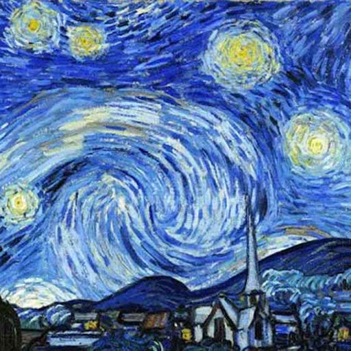
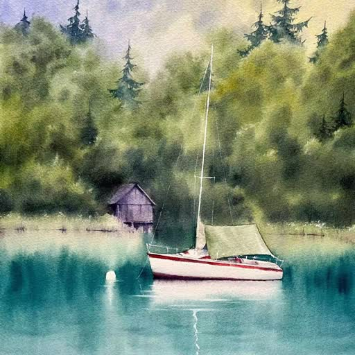
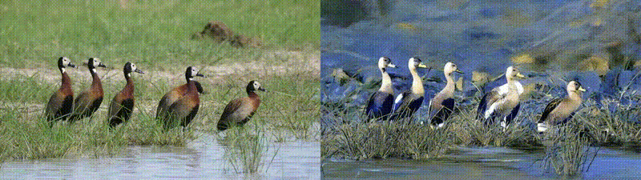
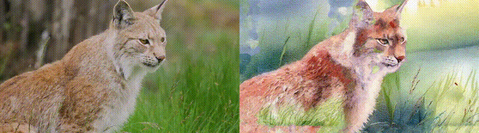

# StyleFlow

This pipeline is highly constructed on InstantStyle and Ezsynth.

Ezsynth makes use of advanced physics based edge detection and RAFT optical flow, which leads to more accurate results during synthesis.

Currently tested on:
```
Windows 10 - Python 3.11 - RTX5070
```
## 🎬 Demo

### Reference Style

| ukiyoe                   | starry_night             | watercolor               |
| ------------------------ | ------------------------ | ------------------------ |
|  |  |  |







## Get started

### Windows
```cmd
rem (Optional) create and activate venv
python -m venv venv
venv\Scripts\activate.bat

rem Install requirements
pip install -r requirements.txt

rem A precompiled ebsynth.dll is included. 
rem If don't want to rebuild, you are ready to go and can skip the following steps.  

rem Clone ebsynth
git clone https://github.com/Trentonom0r3/ebsynth.git

rem build ebsynth as lib
copy .\build_ebs-win64-cpu+cuda.bat .\ebsynth
cd ebsynth && .\build_ebs-win64-cpu+cuda.bat

rem copy lib
cp .\bin\ebsynth.so ..\ezsynth\utils\ebsynth.so

rem cleanup
cd .. && rmdir /s /q .\ebsynth
```

### All
You may also install Cupy and Cupyx to use GPU for some other operations.

## Examples

* With the videos in  `examples\videos`, firstly run `get_frames.py` to save all frames to `examples\origin_frames`.
* Then pick out one or some keyframes, run the `infer_style_controlnet.py` to stylize them (remember to change the parameters to change the reference image and control image).
* Then run `test_redux.py` for an example of generating all stylized frames.
* Finally run `genvideo.py` to turn stylized frames into a video.

## Notable things

1. To run the`infer_style_controlnet.py`, you must download the sdxl_models and put it at the root menu.

   ```
   # download the models
   git lfs install
   git clone https://huggingface.co/h94/IP-Adapter
   move IP-Adapter/sdxl_models sdxl_models
   ```

2. [Ef-RAFT](https://github.com/n3slami/Ef-RAFT) is added 

   To use, download models from [the original repo](https://github.com/n3slami/Ef-RAFT/tree/master/models) and place them in `/ezsynth/utils/flow_utils/ef_raft_models`
   ```
   .gitkeep
   25000_ours-sintel.pth
   ours-things.pth
   ours_sintel.pth
   ```

3. [FlowDiffuser](https://github.com/LA30/FlowDiffuser) is added. 

   To use, download the model from [the original repo](https://github.com/LA30/FlowDiffuser?tab=readme-ov-file#usage) and place it in `/ezsynth/utils/flow_utils/flow_diffusion_models/FlowDiffuser-things.pth`. 

   You will also need to install PyTorch Image Models to run it: `pip install timm`.   On first run, it will download 2 models ~470MB `twins_svt_large (378 MB)` and `twins_svt_small (92 MB)`.

   This increases the VRAM usage significantly when run along with `EbSynth Run` (~15GB, but may not OOM. Tested on 12GB VRAM).

   In that case, It will throw `CUDNN_BACKEND_EXECUTION_PLAN_DESCRIPTOR` error, but shouldn't be fatal, and instead takes ~3x as long to run.

Optical Flow directly affects Flow position warping and Style image warping, controlled by `pos_wgt` and `wrp_wgt` respectively.

**Changes:**
1. Flow is calculated on a frame by frame basis, with correct time orientation, instead of pre-computing only a forward-flow.
2. Padding is applied to Edge detection and Warping to remove border visual distortion.

### Ezsynth

**edge_method**

Edge detection method. Choose from `PST`, `Classic`, or `PAGE`.
* `PST` (Phase Stretch Transform): Good overall structure, but not very detailed.
* `Classic`: A good balance between structure and detail.
* `PAGE` (Phase and Gradient Estimation): Great detail, great structure, but slow.

**video stylization**

Via file paths (see `test_redux.py`):

```python
style_paths = [
    "style000.png",
    "style006.png"
]

ezrunner = Ezsynth(
    style_paths=style_paths,
    image_folder=image_folder,
    cfg=RunConfig(pre_mask=False, feather=5, return_masked_only=False),
    edge_method="PAGE",
    raft_flow_model_name="sintel",
    mask_folder=mask_folder,
    do_mask=True
)

only_mode = None
stylized_frames, err_frames  = ezrunner.run_sequences(only_mode)

save_seq(stylized_frames, "output")
```

#### Ebsynth guide weights params    
* `edg_wgt (float)`: Edge detect weights. Defaults to `1.0`.
* `img_wgt (float)`: Original image weights. Defaults to `6.0`.
* `pos_wgt (float)`: Flow position warping weights. Defaults to `2.0`.
* `wrp_wgt (float)`: Warped style image weight. Defaults to `0.5`.
#### Blending params
* `use_gpu (bool)`: Use GPU for Histogram Blending (Only affect Blend mode). Faster than CPU. Defaults to `False`.
  
* `use_lsqr (bool)`: Use LSQR (Least-squares solver) instead of LSMR (Iterative solver for least-squares) for Poisson blending step. LSQR often yield better results. May change to LSMR for speed (depends).  Defaults to `True`.
  
* `use_poisson_cupy (bool)`: Use Cupy GPU acceleration for Poisson blending step. Uses LSMR (overrides `use_lsqr`). May not yield better speed. Defaults to `False`.
  
* `poisson_maxiter (int | None)`: Max iteration to calculate Poisson Least-squares (only affect LSMR mode). Expect positive integers. Defaults to `None`.
  
* `only_mode (str)`: Skip blending, only run one pass per sequence. Valid values:
  * `MODE_FWD = "forward"` (Will only run forward mode if `sequence.mode` is blend)
  
  * `MODE_REV = "reverse"` (Will only run reverse mode if `sequence.mode` is blend)
  
  * Defaults to `MODE_NON = "none"`.
    
#### Masking params
* `do_mask (bool)`: Whether to apply mask. Defaults to `False`.

* `pre_mask (bool)`: Whether to mask the inputs and styles before `RUN` or after. Pre-mask takes ~2x time to run per frame. Could be due to Ebsynth.dll implementation. Defaults to `False`.     
  
* `feather (int)`: Feather Gaussian radius to apply on the mask results. Only affect if `return_masked_only == False`. Expects integers. Defaults to `0`.

## Credits

InstantX - https://github.com/instantX-research/InstantStyle

```
@article{wang2024instantstyle,
  title={InstantStyle: Free Lunch towards Style-Preserving in Text-to-Image Generation},
  author={Wang, Haofan and Wang, Qixun and Bai, Xu and Qin, Zekui and Chen, Anthony},
  journal={arXiv preprint arXiv:2404.02733},
  year={2024}
}
```

Trentonom0r3 - https://github.com/Trentonom0r3/Ezsynth

jamriska - https://github.com/jamriska/ebsynth

```
@misc{Jamriska2018,
  author = {Jamriska, Ondrej},
  title = {Ebsynth: Fast Example-based Image Synthesis and Style Transfer},
  year = {2018},
  publisher = {GitHub},
  journal = {GitHub repository},
  howpublished = {\url{https://github.com/jamriska/ebsynth}},
}
```
```
Ondřej Jamriška, Šárka Sochorová, Ondřej Texler, Michal Lukáč, Jakub Fišer, Jingwan Lu, Eli Shechtman, and Daniel Sýkora. 2019. Stylizing Video by Example. ACM Trans. Graph. 38, 4, Article 107 (July 2019), 11 pages. https://doi.org/10.1145/3306346.3323006
```

FuouM - https://github.com/FuouM
pravdomil - https://github.com/pravdomil
xy-gao - https://github.com/xy-gao

https://github.com/princeton-vl/RAFT

```
RAFT: Recurrent All Pairs Field Transforms for Optical Flow
ECCV 2020
Zachary Teed and Jia Deng
```

https://github.com/n3slami/Ef-RAFT

```
@inproceedings{eslami2024rethinking,
  title={Rethinking RAFT for efficient optical flow},
  author={Eslami, Navid and Arefi, Farnoosh and Mansourian, Amir M and Kasaei, Shohreh},
  booktitle={2024 13th Iranian/3rd International Machine Vision and Image Processing Conference (MVIP)},
  pages={1--7},
  year={2024},
  organization={IEEE}
}
```

https://github.com/LA30/FlowDiffuser

```
@inproceedings{luo2024flowdiffuser,
  title={FlowDiffuser: Advancing Optical Flow Estimation with Diffusion Models},
  author={Luo, Ao and Li, Xin and Yang, Fan and Liu, Jiangyu and Fan, Haoqiang and Liu, Shuaicheng},
  booktitle={Proceedings of the IEEE/CVF Conference on Computer Vision and Pattern Recognition},
  pages={19167--19176},
  year={2024}
}
```
